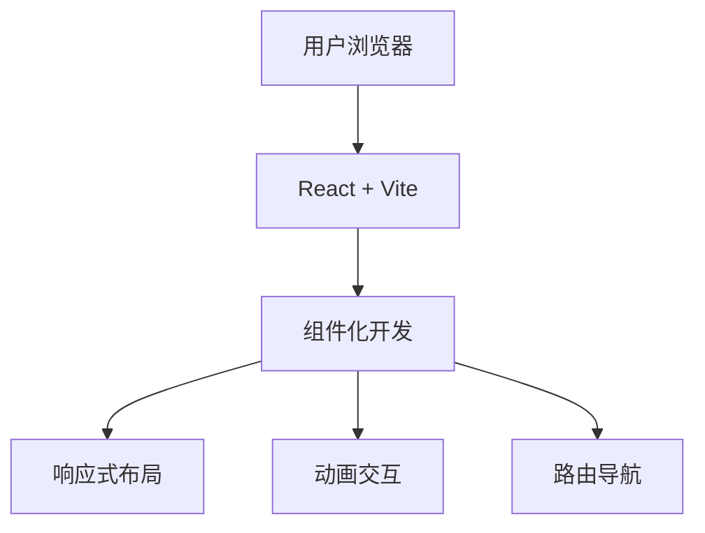

## 1. Architecture Design
单页应用（SPA）架构，纯前端实现，专注于用户界面和交互体验。



## 2. Technology Description
- **Frontend**: React@18 + TypeScript + Tailwind CSS@3 + Vite
- **Initialization Tool**: vite-init
- **Backend**: None（纯前端项目）
- **Database**: None
- **状态管理**: React Context API（轻量级需求）
- **图标库**: Lucide React
- **动画**: Framer Motion（可选）或 CSS 原生动画

## 3. Route Definitions
| Route | Purpose |
|-------|---------|
| / | 主页（Home） |
| /services/geo | GEO 服务详情页 |
| /services/fde | FDE 服务详情页 |
| /cases | 案例展示页 |
| /about | 关于我们页 |

## 4. Project Structure
```
/workspace
├── src/
│   ├── components/
│   │   ├── Navbar.tsx          # 导航栏组件
│   │   ├── Hero.tsx            # Hero 区域组件
│   │   ├── ServiceCard.tsx     # 服务卡片组件
│   │   ├── PricingCard.tsx     # 价格套餐组件
│   │   ├── FounderSection.tsx  # 创始人区域组件
│   │   ├── Newsletter.tsx      # 订阅表单组件
│   │   └── Footer.tsx          # 页脚组件
│   ├── pages/
│   │   ├── Home.tsx            # 主页
│   │   ├── GeoService.tsx      # GEO 服务页
│   │   ├── FdeService.tsx      # FDE 服务页
│   │   ├── Cases.tsx           # 案例页
│   │   └── About.tsx           # 关于页
│   ├── App.tsx                 # 主应用组件
│   ├── main.tsx                # 入口文件
│   └── index.css               # 全局样式
├── public/                     # 静态资源
├── package.json
├── tsconfig.json
├── vite.config.ts
├── tailwind.config.js
└── postcss.config.js
```

## 5. Core Components
### 5.1 Navbar 组件
- 固定顶部导航
- 滚动时背景透明度变化
- 移动端汉堡菜单
- 链接：主页、GEO服务、FDE服务、案例、关于

### 5.2 Hero 组件
- 全屏 hero 区域
- 动态渐变背景
- 品牌诊断输入框
- 打字机效果标题

### 5.3 ServiceCard 组件
- 玻璃拟态设计
- 悬停动画效果
- 响应式布局

### 5.4 PricingCard 组件
- 套餐对比展示
- 推荐套餐高亮
- 功能列表勾选动画

## 6. Styling Strategy
- **Tailwind CSS 为主**，配合自定义 CSS
- **CSS 变量**：定义主题颜色和间距
- **响应式类**：使用 Tailwind 的 sm/md/lg/xl 断点
- **动画**：CSS transitions + keyframes，配合 JavaScript 触发
- **玻璃拟态**：backdrop-filter + rgba 背景

