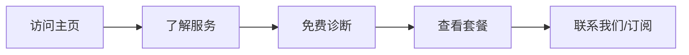

## 1. Product Overview
朴风 Pu Feng 品牌网站升级，专注于 AI 搜索时代的品牌可见度优化服务。为企业和品牌提供专业的 GEO（AI 可见度优化）和 FDE（AI 系统工程师）服务，帮助品牌在 AI 搜索时代提升曝光度和竞争力。

## 2. Core Features

### 2.2 Feature Module
1. **主页**: hero 区域、导航、服务介绍、案例展示、创始人故事、订阅表单
2. **服务页面**: GEO 服务详情、FDE 服务详情
3. **案例页面**: 成功案例展示
4. **关于页面**: 品牌和创始人介绍

### 2.3 Page Details
| Page Name | Module Name | Feature description |
|-----------|-------------|---------------------|
| 主页 | Hero 区域 | 大标题、品牌诊断输入框、动态背景效果 |
| 主页 | 服务介绍 | GEO 和 FDE 服务卡片、悬停交互效果 |
| 主页 | 服务套餐 | 三种套餐对比（诊断、Base、Pro）、滚动动画 |
| 主页 | 创始人故事 | 图片+文字展示、流畅过渡 |
| 主页 | 订阅表单 | 邮箱订阅、提交反馈 |
| 服务页面 | GEO 详情 | 完整服务说明、功能列表、CTA |
| 服务页面 | FDE 详情 | 完整服务说明、功能列表、CTA |

## 3. Core Process
用户访问网站 → 了解服务 → 使用免费诊断工具 → 查看套餐 → 联系/订阅

## 4. User Interface Design
### 4.1 Design Style
- **主色调**: 深色背景（黑/深灰）+ 霓虹蓝/青绿色渐变
- **辅助色**: 柔和的紫色、粉色渐变作为点缀
- **按钮风格**: 圆角矩形、渐变背景、悬停发光效果
- **字体**: 现代无衬线字体（Poppins 或 Geist），大标题 bold，正文轻盈
- **布局风格**: 卡片式、全屏区块、大胆留白、不对称设计
- **图标风格**: 简约线性图标 + 霓虹发光效果

### 4.2 Page Design Overview
| Page Name | Module Name | UI Elements |
|-----------|-------------|-------------|
| 主页 | Hero 区域 | 渐变背景、动态粒子效果、大标题打字动画、输入框聚焦效果 |
| 主页 | 服务卡片 | 玻璃拟态设计、悬浮提升效果、图标动画 |
| 主页 | 套餐对比 | 卡片式布局、推荐套餐高亮、特性勾选动画 |
| 主页 | 创始人区域 | 图片+文字左右布局、滚动视差 |
| 所有页面 | 导航 | 固定顶部、滚动透明度变化、移动端汉堡菜单 |

### 4.3 Responsiveness
- Desktop-first 设计，完美适配桌面端
- 移动端完全响应式，优化触摸交互
- 平板端自适应布局
- 断点：640px（移动）、768px（平板）、1024px（桌面）、1280px（大屏）

### 4.4 交互与动画
- 页面加载时的元素渐显动画
- 滚动触发的元素入场动画
- 按钮和卡片的悬停效果
- 平滑滚动导航
- 输入框聚焦和提交反馈

